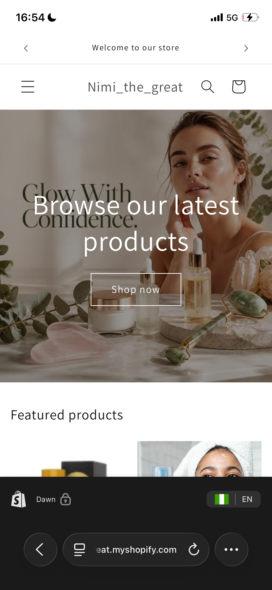
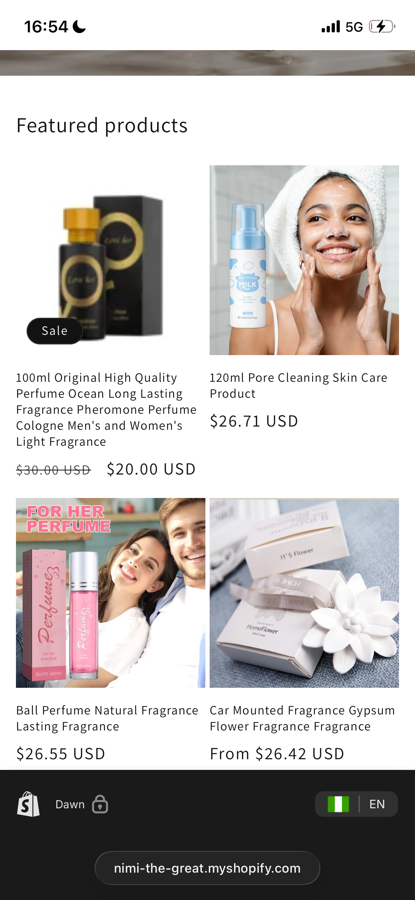
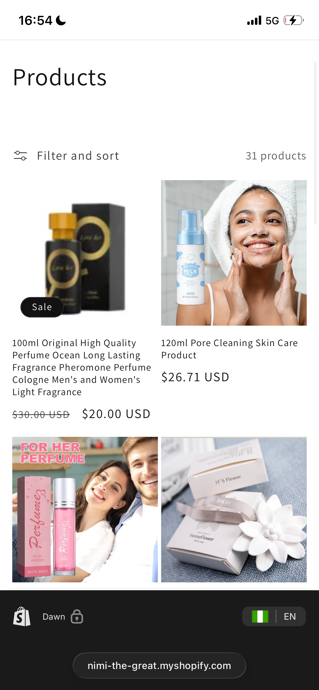
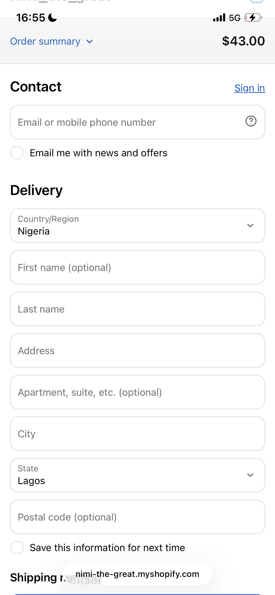
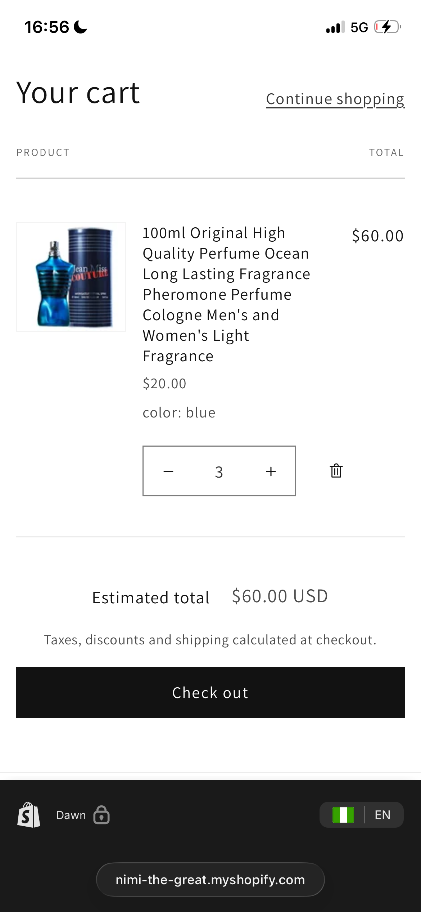
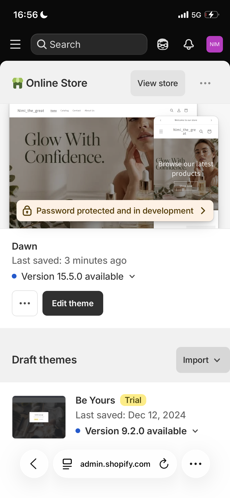

# Shopify Store Case Study – Nimi_the_great

## Overview

This project showcases a Shopify e-commerce store I designed and customized for a beauty and skincare brand using Shopify's Dawn theme.

The goal was to create a clean, modern, and mobile-friendly online shopping experience that allows customers to browse products, add items to their cart, and complete purchases through Shopify's secure checkout system.

## Project Objective

The objective of this project was to build a professional Shopify store that demonstrates my ability to:

- Design responsive e-commerce websites
- Organize products into collections
- Customize Shopify themes
- Create an intuitive shopping experience
- Configure store navigation and essential pages
- Optimize the store for mobile devices

## Live Store

**Store URL:**

https://nimi-the-great.myshopify.com

## Features

- Responsive Shopify storefront
- Beauty and skincare product catalog
- Product collections
- Featured products section
- Shopping cart
- Secure Shopify checkout
- Mobile-friendly design
- Contact page
- About Us page
- Navigation menu
- Search functionality
- Shopify theme customization

## My Responsibilities

Throughout this project, I was responsible for:

- Store setup and configuration
- Theme customization using the Shopify Dawn theme
- Product upload and organization
- Collection creation and management
- Product pricing and inventory management
- Homepage customization
- Navigation menu configuration
- Contact and About Us page creation
- Mobile responsiveness testing
- Checkout flow testing

## Technologies Used

- Shopify
- Shopify Dawn Theme
- Shopify Admin Dashboard
- Product Management
- Theme Customization

## Screenshots

### Homepage

### Product Catalog

### Featured Products

### Shopping Cart

### Checkout Page

### Shopify Admin Dashboard

## What I Learned

Working on this project strengthened my skills in:

- Shopify store management
- Theme customization
- Product organization
- Collection management
- User experience (UX)
- Mobile responsiveness
- E-commerce workflows
- Store testing and quality assurance

## Future Improvements

Potential enhancements for this store include:

- Custom domain integration
- Customer reviews
- Email marketing integration
- Advanced product filtering
- SEO optimization
- Analytics and conversion tracking

## Author

**Adeyemo Jesudunmomi**

Shopify Website Designer passionate about building clean, responsive, and user-friendly e-commerce stores that help businesses sell online.

GitHub: https://github.com/adeyemojesudunmomi
